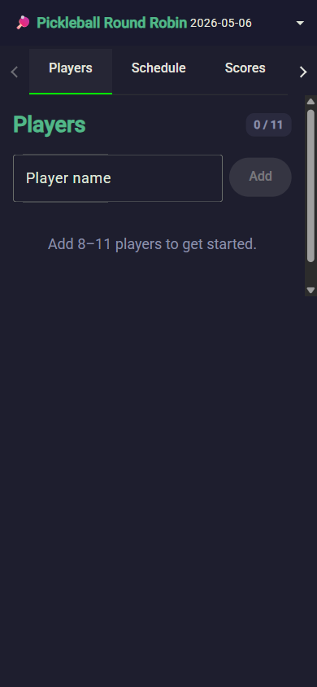
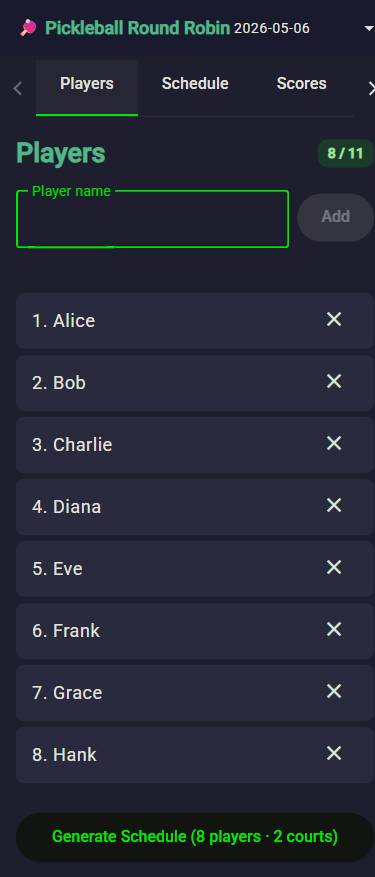
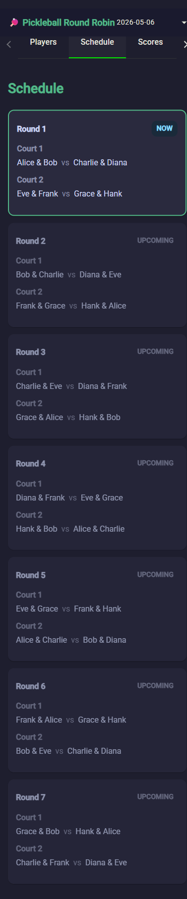
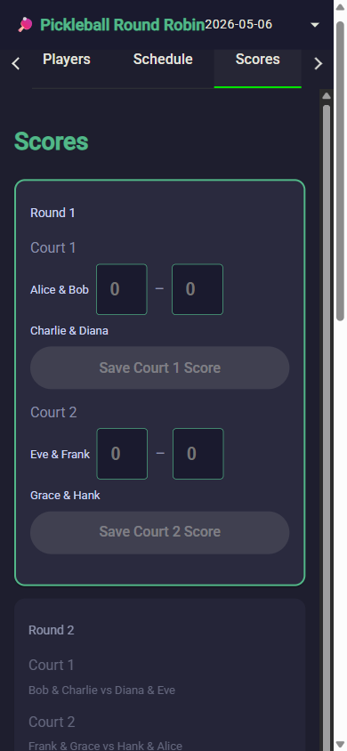
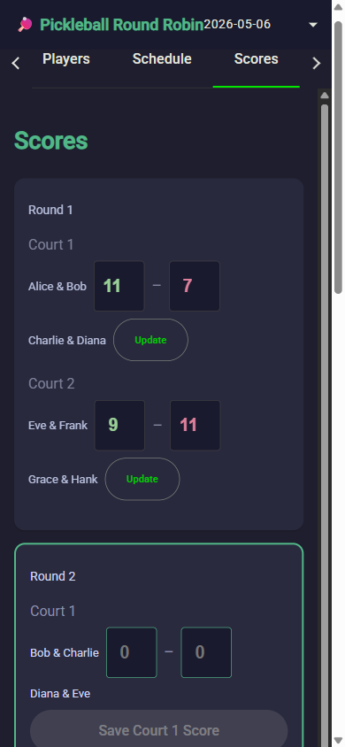
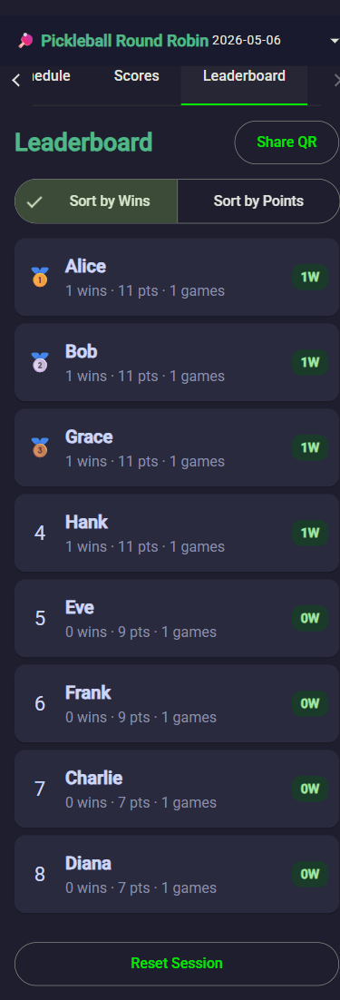
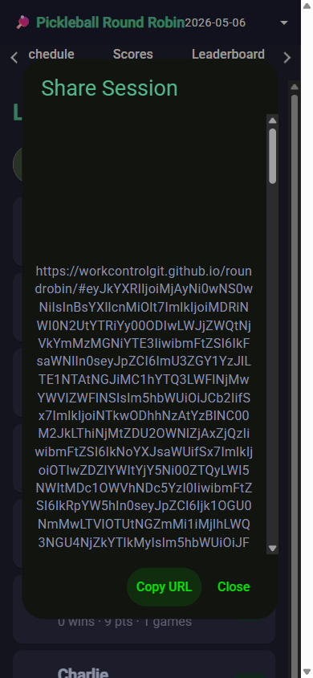
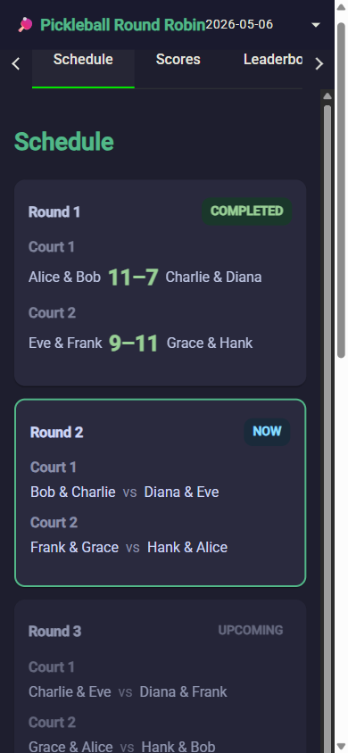

# Skip the Spreadsheet: A Faster Way to Run Pickleball Round Robin Games

*A simple phone-friendly app for getting impromptu round-robin sessions started faster.*

If you help organize pickleball games, you know the awkward part often starts before anyone serves.

Everyone is ready to play, but someone still has to figure out who is here, who should rotate in, and how to get games started without too much standing around. That usually means a notes app, a spreadsheet, or a whiteboard and more setup than anyone wants.

I built RoundRobin to make that part easier. It is a simple app you can open on your phone to set up a round-robin session quickly, without organizing everything by hand at the courts.

## What Is a Round Robin in Pickleball?

A round robin is one of the most popular formats for recreational and open-play pickleball. Instead of bracket-style elimination — where you lose and you are done — a round robin keeps everyone playing throughout the session.

Here is how it works: all players are divided into rotating partnerships, and each round pairs different players together across the available courts. By the end of the session, you have played with and against most of the group, everyone has gotten roughly equal court time, and a leaderboard reflects who won the most games overall.

It is a format that rewards consistency rather than a single hot match, and it keeps things social since you are constantly changing partners and opponents. That is why it shows up at open play mornings, club nights, and casual tournaments everywhere.

The challenge is the logistics. With 8 to 11 players and multiple courts, figuring out who plays who each round — and keeping track of scores across the session — takes more coordination than most people want to manage on their phone between games.

## The Problem With Impromptu Pickleball Setup

The hardest part is usually not making the first list. It is keeping that list useful once the session starts to move.

One player shows up late. Another needs to leave after two games. Someone wants to sit out a round. In a casual group, the lineup changes constantly, and small changes quickly turn into confusion about who should play next.

That is where spreadsheets, whiteboards, and notes apps start to break down. They can hold names, but they do not do much to help one person make quick, fair adjustments without slowing everyone else down.

## A Simpler Way to Get Games Started

RoundRobin is built for one job: helping you get from "who showed up?" to "let's play" with less delay.

Instead of managing names and matchups by hand, you can add the players who are there and build a round-robin schedule in a few taps.

Then you can use that schedule to keep the session moving.

It is not meant to feel like tournament software. It is meant to be useful when you are standing at the courts and just want to get people playing.

## How to Use It

Using the app is straightforward:

**Step 1 — Open the app and add your players**

Open RoundRobin on your phone and type in the names of everyone who showed up. The counter shows you how many you have added and when you have enough to generate a schedule.

Once you have added 8 to 11 players, the Generate Schedule button appears.

**Step 2 — Generate the round-robin schedule**

Tap Generate Schedule. The app builds a full round-robin instantly — every player gets matched up fairly across courts, with no one sitting out more than necessary.

Round 1 is highlighted as the active round so you know exactly where to start.

**Step 3 — Track scores as you play**

Switch to the Scores tab to enter results after each round. Both courts are shown side by side. Enter the scores and save them — the app advances to the next active round automatically.

Once a round is complete, the saved scores are displayed inline and the next round becomes active.

**Step 4 — Check the leaderboard**

After each round, the Leaderboard tab updates with current standings — wins, total points, and games played for every player. The top three earn a medal ranking.

**Step 5 — Share the session (optional)**

At any point you can tap Share QR on the Leaderboard tab to generate a shareable URL. Anyone with the link can view the session in read-only mode — useful if you want to post results to a group chat or let players check standings on their own phones.

The schedule view also keeps the full picture clear as rounds progress, showing completed scores inline and the current active round highlighted.

That is the whole workflow. Less setup, less confusion, and more time playing.

## Why This Works Better for Casual Sessions

Most pickleball sessions are not run like formal events. People arrive at different times, some players leave early, and the group changes as the session goes.

That is exactly where a simple phone-first tool helps most.

RoundRobin helps you:

- Start games faster
- Avoid spreadsheet juggling on your phone
- Reduce confusion when organizing players
- Keep impromptu sessions moving

If you regularly help coordinate open play, a simpler setup at the start can make the whole session run more smoothly.

## Try It Before Your Next Session

If you organize pickleball games and want a simpler way to get people on the court, try RoundRobin here:

https://workcontrolgit.github.io/roundrobin/

Open it on your phone, add the players who showed up, and see how quickly you can get your next impromptu session moving.
