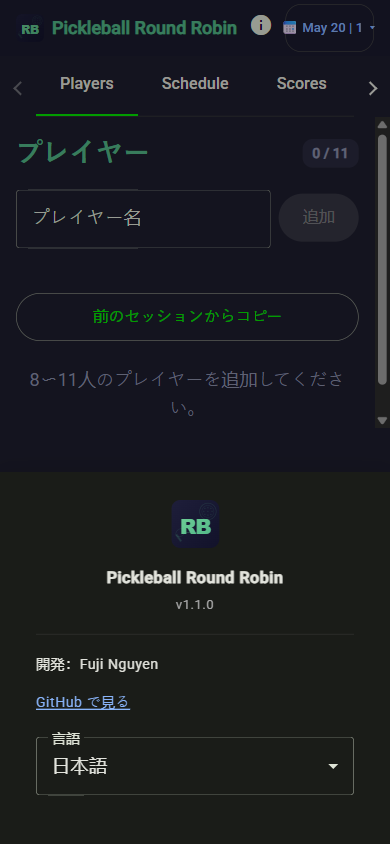
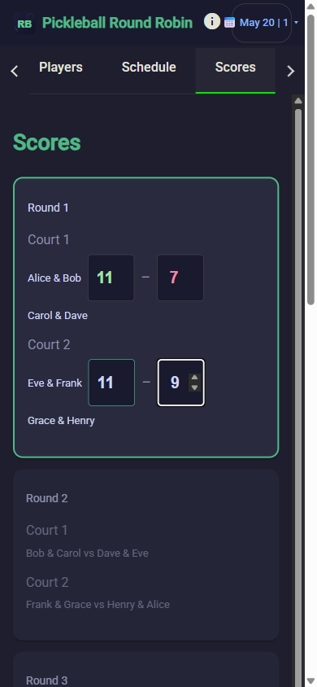
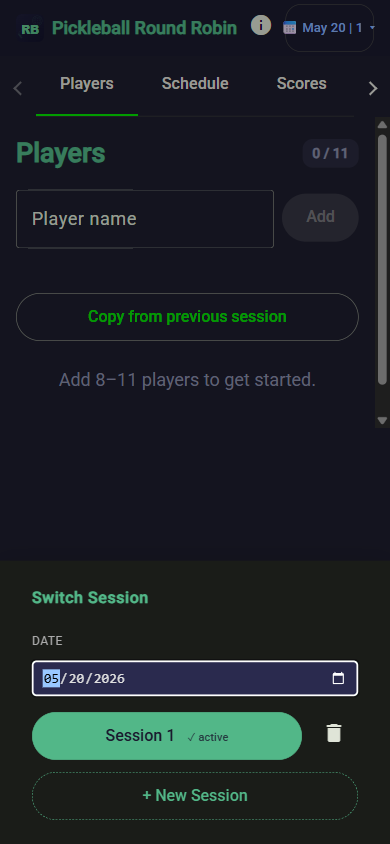
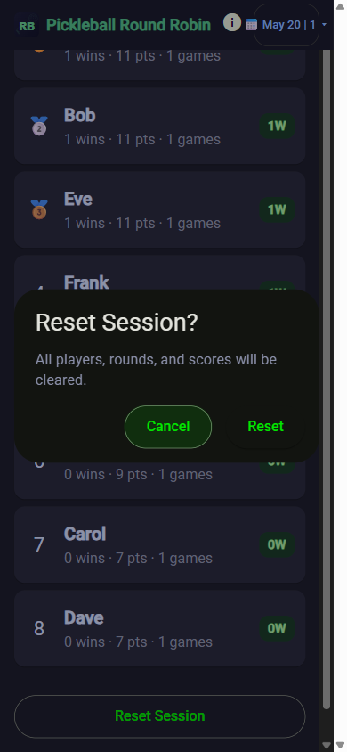

# RoundRobin 1.1.0: Four Things That Got Better for Pickleball Organizers

RoundRobin is a phone-friendly app that helps you get from "who showed up?" to a running round-robin session in a few taps — no spreadsheet, no whiteboard, no app install. Since the first version, several things that were slightly awkward got fixed. Here's what changed.

---

## 1. Copy Players from Last Session

If you run the same group week after week, you already know who shows up. There are usually eight or ten regulars, maybe a couple of subs who rotate in. But even when the roster barely changes, the old version of RoundRobin started you from a completely blank player list every single time.

That meant retyping the same names, in the same order, before every session. It is a small annoyance on its own, but at 8am on a Saturday with courts waiting and players milling around, it adds up. Nobody wants to be the organizer fumbling with a phone when everyone else is ready to play.

Starting over from a blank list every session adds unnecessary friction. With 1.1.0, there is now a button on the Players tab that pulls in the roster from your previous session with one tap.

Open the app, hit Copy from previous session, and the names from last time appear in the list. You can review and edit from there — add someone new, remove a no-show, fix a misspelling — before moving on to the next step. For most regular groups, you will be at the Generate Schedule step in under a minute, without having typed a single name.

---

## 2. Play in Your Language

The first version of RoundRobin was English-only. If your group speaks Spanish, French, or another language, the labels and buttons were still in English regardless — which is fine if everyone reads English, but not ideal when your open-play crowd is more mixed.

Pickleball has been growing fast, and open-play sessions in particular tend to draw people from all kinds of backgrounds. Many community courts have regulars who speak a variety of languages, and making the person who organized the session also act as a real-time translator for every screen label is an unnecessary hurdle.

In 1.1.0 the app ships with multi-language support. A language selector in the About sheet lets you switch the full interface — menus, labels, buttons, everything — in a single tap. There is no reload, no separate version to find. You open About, choose your language, and the whole UI updates immediately.

It is a small change with a meaningful impact for any group that does not primarily use English. Handing someone your phone and asking them to enter scores is a lot easier when the screen is already in their language.

---

## 3. Scores Save Automatically

A typical round-robin session runs 45 to 60 minutes, sometimes longer. During that time your phone might lock, you might switch to a text thread, or someone might borrow it to check the schedule. In earlier versions, none of that was a problem — until someone accidentally closed the browser tab and reopened the app to a completely blank score sheet.

If you have ever had that happen, you know the exact feeling: you open the tab, the session is gone, and you have to decide whether to reconstruct scores from memory or just restart. Neither option is good halfway through a session.

In 1.1.0 scores save automatically as you enter them. Close the tab, switch apps, lock your phone — when you come back, the session is exactly where you left it. The rounds are there, the scores you already entered are there, and you can pick up right where you stopped without asking anyone to remember what the score was.

No save button. No lost progress.

---

## 4. Start a New Session Without Losing the Old One

Here is a scenario that happens more than you might expect: you run a morning session with one group, finalize the leaderboard, celebrate the winner. Then the afternoon arrives and a completely different group shows up on the same courts. You want to start fresh for the new group — but you would also like to keep the morning session's results around.

In 1.1.0, you do not have to choose. The app organizes sessions by date, and you can add a new session under the same date without touching the one you already ran. Tap the date chip at the top, and you will see the option to create a new session alongside any existing ones for that day. The morning group's leaderboard stays intact while you set up the afternoon group from scratch.

When you do want to clear everything — a full reset with no leftover data — that option is still there. But in the original version it had no confirmation. One tap and the session was gone, which was a real problem if you hit Reset by accident in the middle of entering scores.

In 1.1.0, resetting requires a deliberate confirmation step. A dialog appears and asks you to confirm before anything is cleared. It is one extra tap, but it means that bumping the wrong button on a crowded screen will not silently wipe a session you are still running.

Two different needs, two different tools: add a new session for the day when you want a fresh start alongside the old one, or reset when you want a clean slate entirely.

---

## Try It at Your Next Session

RoundRobin is still a single URL — no app store, no install, just open it on your phone.

The 1.1.0 update is live now:

https://workcontrolgit.github.io/roundrobin

If this is your first time hearing about it, the [original post](https://medium.com/@workcontrolgit/skip-the-spreadsheet-a-faster-way-to-run-pickleball-round-robin-games-REPLACE_WITH_REAL_SLUG) walks through the full workflow from adding players to sharing the final leaderboard.
